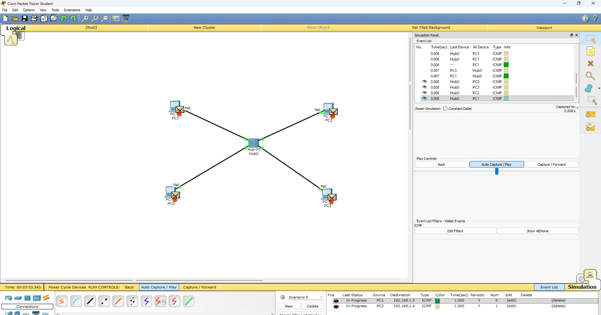
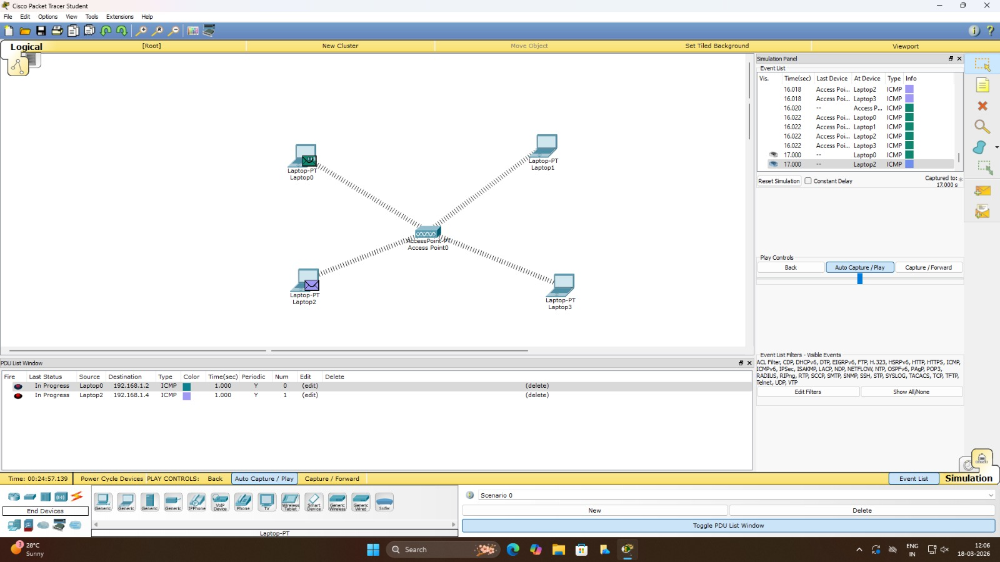
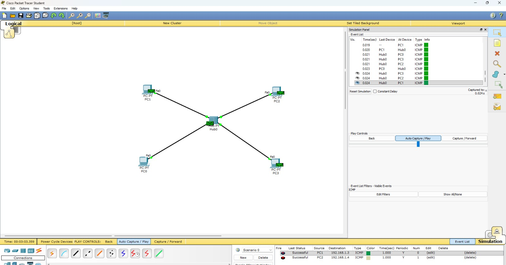

🧪 Experiment Title / Aim:

To simulate and analyze multiple access protocols — Pure ALOHA, Slotted ALOHA, CSMA/CD, and CSMA/CA — using Cisco Packet Tracer and evaluate their performance in terms of collision handling and transmission efficiency.

🎯 Objective:
- To understand the working of multiple access protocols

- To implement Pure ALOHA, Slotted ALOHA, CSMA/CD, and CSMA/CA

- To observe collisions and retransmissions

- To compare efficiency under different network conditions

📖 Theory:

🔹 CSMA/CD

Devices sense the channel before transmitting. If a collision occurs, it is detected and transmission stops immediately. Used in wired networks.

🔹 CSMA/CA

Devices avoid collisions using techniques like RTS/CTS and backoff algorithms. Mainly used in wireless networks.

🌐 Network Topology:

- Multiple PCs connected using:

- Hub (for collision-based communication)

- Switch/Wireless device (for CSMA/CA)

- All devices are assigned IP addresses in the same network

📸 Screenshot:

- Figure 1: CSMA-CD Network Topology:

- Figure 2: CSMA-CA Network Topology:

🛠️ Step-by-Step Procedure:

1. Open Cisco Packet Tracer

2. Create a network with multiple PCs

3. Connect devices using:

- Hub (for ALOHA & CSMA/CD)

- Wireless Router (for CSMA/CA)

4. Assign IP addresses manually to all PCs

5. Switch to Simulation Mode

6. Use Add Simple PDU (Ping) between devices

7. Run simulation and observe:

- Packet flow

- Collisions

- Retransmissions

8. Repeat for each protocol setup
   

⚙️ Configuration Commands:

PC IP Configuration (Example)

On each PC:

IP Address: 192.168.1.1

Subnet Mask: 255.255.255.0

Default Gateway: 192.168.1.254

(Assign different IPs for each device)

👉 No CLI commands are required as configuration is done via GUI in Packet Tracer.

📊 Observations / Results:

🔹 CSMA/CD

- Collisions detected and handled quickly

- Efficient transmission in wired network

- Less delay

📸 Screenshot: 

🔹 CSMA/CA

- Collisions avoided using control mechanisms

- Very efficient in wireless setup

- Slight delay due to waiting

📸 Screenshot:

🧾 Conclusion

- CSMA/CD is efficient for wired networks due to collision detection

- CSMA/CA provides the best performance by avoiding collisions in wireless networks

