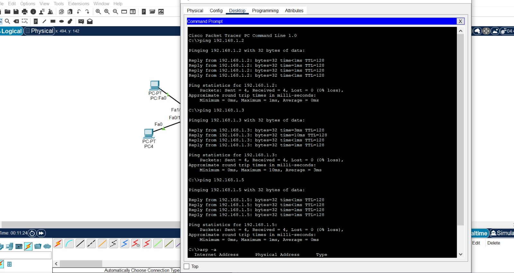

<h1>Experiment 10</h1>

<h2>Objective</h2>

Implement a DNS and DDNS simulation to demonstrate domain name resolution and dynamic updates. Create a simple client-server application that queries and updates the DNS records.

<h2>Theory</h2>

DNS translates human-readable domain names (like example.com) into the numerical IP addresses (like 192.168.1.2) required for routing data across networks. DDNS (Dynamic DNS) allows these resource records to be updated dynamically in real-time, ensuring that the domain name always points to the correct IP address even if the host's address changes.

<h2>Network Topology<?
  


(Above: A network topology including a DNS Server and client devices).

<h3>Step-by-step Procedure</h3>

1. **Topology Setup:** Created a network topology with a Server and client PCs, assigning appropriate IP addresses to all devices.
2. **Enable Service:** Clicked on the Server, navigated to the Services tab, and turned the DNS service ON.
3. **Record Creation:** Added a DNS A-Record: Domain Name example.com, mapped to IP Address 192.168.1.2.
4. **Client Configuration:** On the client PCs, configured the network settings to point to the Server's IP address as the primary DNS Server.
5. **Web Browser Test:** On PC0, opened the Web Browser and entered example.com to observe the browser resolving the domain and loading the page.
6. **Command Line Query:** On PC1, opened the Command Prompt and utilized the nslookup example.com command to manually query the DNS server.
7. **Dynamic Update:** Dynamically updated the IP address for example.com on the Server and verified the change by re-running the query from the client to confirm DDNS behavior.

<h2>Configuration Commands</h2>

- PC1 Command Prompt: ``` nslookup example.com```
  

<h2>Observations / Results</h2>



- The client web browser successfully reached the target server by resolving example.com to its associated IP address.
  
- The nslookup command confirmed the DNS server's translation, providing the Server's address and the mapped record.
  
- Subsequent dynamic updates to the server records were instantly reflected in the client queries, demonstrating successful record management.
  
<h2>Conclusion</h2>

Successfully configured and tested DNS services in a simulated environment. The experiment demonstrated how client applications seamlessly interact with DNS servers to translate domain names into routable IP addresses, highlighting the importance of the DNS system in network usability.
