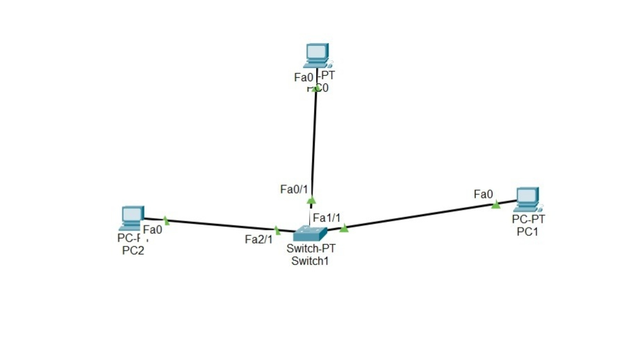

<h1>Experiment 9</h1>

<h2>Objective</h2>

Implement a transport layer simulation to demonstrate process-to-process communication using UDP, TCP, and SCTP .Compare the protocols in terms of connection establishment, data transmission and congestion control.

<h2>Theory</h2>

-  **TCP (Transmission Control Protocol):** A connection-oriented, reliable protocol that guarantees delivery. It establishes a connection via a 3-way handshake (SYN, SYN-ACK, ACK) before sending data, ensuring the receiver is ready.
  
-  **UDP (User Datagram Protocol):** A connectionless, unreliable protocol. It sends data immediately without verifying readiness or guaranteeing delivery, making it faster with less overhead.
  
-  **SCTP (Stream Control Transmission Protocol):** A message-oriented protocol that combines features of both TCP and UDP, providing multi-homing and multi-streaming capabilities.
  
   
<h2>Network Topology</h2>

(Above: A topology with client PCs and a Server to simulate process-to-process communication).

<h3>Step-by-step Procedure</h3>

1. **Topology Design:** Designed a network topology with PCs and a Server connected via a Switch.
2. **IP Addressing:** Assigned static IP Addresses to the PCs and the Server.
3. **TCP Simulation:** Configured an HTTP service on the Server. Accessed the server via the PC's web browser to generate TCP traffic.
4. **UDP Simulation:** Configured a DNS service on the Server. Ran a domain query from the PC to generate UDP traffic.
5. **Traffic Filtering:** Switched to Simulation Mode and filtered the Event List to show only TCP and UDP packets.
6. **Header Inspection:** Clicked on the respective Protocol Data Units (PDUs) to inspect the transport layer headers, port numbers, and connection flags.
   
<h2>Configuration Commands</h2>

N/A (Configurations handled via the Server's Service tab and PC desktop applications).

<h2>Observations / Results</h2>

- **TCP:** Inspection of the TCP PDUs revealed the explicit 3-way handshake process establishing the connection prior to the HTTP data payload transfer.
  
- **UDP:** The UDP PDUs were transmitted immediately without any prior handshake or acknowledgment mechanisms, showing a smaller header size.
  
<h2>Conclusion</h2>

The simulation successfully demonstrated the behavioral differences between transport layer protocols. TCP's connection-oriented features provide necessary reliability for applications like web browsing, whereas UDP's lack of overhead is ideal for fast, connectionless queries like DNS.
